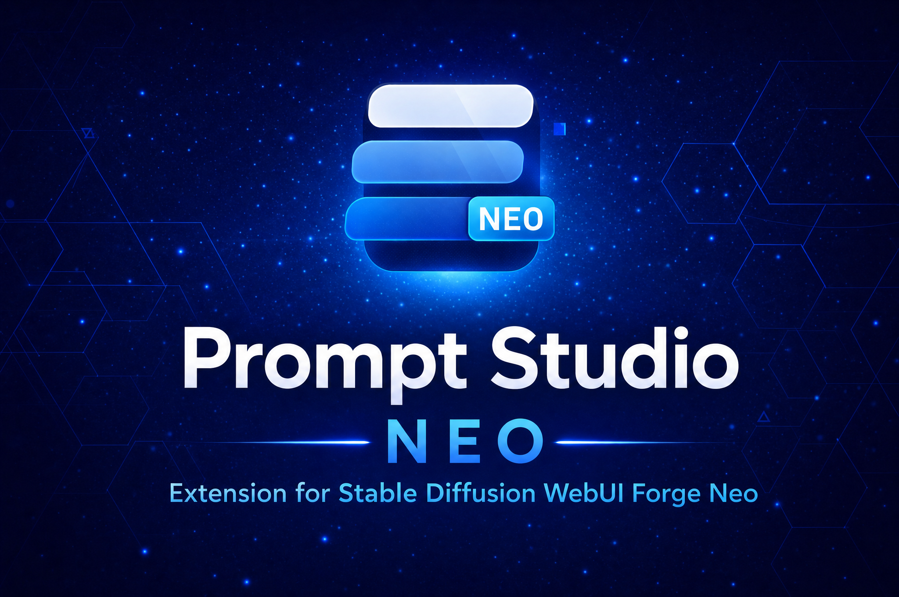

  

# 🎛️ Prompt Studio Neo

> **Extension for [Stable Diffusion WebUI Forge - Neo](https://github.com/Haoming02/sd-webui-forge-classic/tree/neo)** · **[📖 Full documentation on the Wiki](https://github.com/eduardoabreu81/sd-webui-prompt-studio-neo/wiki)**

**The all-in-one prompt workstation for Forge Neo** — an interactive tag-chip prompt editor with translation, history, favorites, and quality presets, plus Danbooru/e621 tag autocompletion with LoRA trigger word injection. Two battle-tested extensions, one install.

> [!Important]
> **This is a unified fork.** Prompt Studio Neo merges two projects into a single extension:
> the prompt editor created by [Physton](https://github.com/Physton) in [sd-webui-prompt-all-in-one](https://github.com/Physton/sd-webui-prompt-all-in-one), and the tag autocompletion created by [DominikDoom](https://github.com/DominikDoom) in [a1111-sd-webui-tagcomplete](https://github.com/DominikDoom/a1111-sd-webui-tagcomplete). It is maintained exclusively for Forge Neo. If you are not running Forge Neo, **please use the original extensions instead**.

---

## 📋 Table of Contents

- [What's New](#-whats-new)
- [Changelog](#-changelog)
- [Roadmap](#️-roadmap)
- [Features](#-features)
  - [Prompt Editing](#️-prompt-editing)
  - [Tag Autocompletion](#️-tag-autocompletion)
  - [Live Tag Colorizer](#-live-tag-colorizer-)
  - [Quality Presets](#-quality-presets-)
- [Demo](#-demo)
- [Installation](#-installation)
- [Language Support](#-language-support)
- [Translation APIs](#-translation-apis)
- [Tag Lists](#-tag-lists)
- [Credits](#-credits)

---

## 🆕 What's New

### v0.1

> First release of the unified extension — the two modules share one settings section, one metadata backend, and one extra-network catalog. Full pre-merge histories (now legacy): [Prompt All-in-One module](docs/README-prompt-all-in-one.md) · [Tag Autocomplete module](docs/README-tagcomplete.md).

- **Live Tag Colorizer** — read-only overlay that colorizes prompt text by tag type as you type; see [Live Tag Colorizer](#-live-tag-colorizer-) under Features
- **Shared model metadata cache** — PAIO and TAC reuse one CivitAI/SHA-256 backend owned by Prompt Studio Neo
- **Optional Browser Neo integration** — existing `.json`, `.api_info.json`, and checkpoint hash data can be consumed read-only when available
- **Forge-native extra-network catalog** — LoRA paths, aliases, and cached network hashes come from Forge Neo once per refresh instead of repeated directory scans
- **Artist autocomplete with `@`** — artist-only suggestions and optional Anima-aware `@` insertion
- **📌 Pin tags** — per-checkpoint custom Quality Preset overrides
- **Anima** added as a built-in Quality Presets template, with an Insert scaffold for its structured prompt format

---

## 📖 Changelog

### v0.1

- Merged `sd-webui-prompt-all-in-one-neo` (v0.3.3) and `sd-webui-tagcomplete-neo` (v0.2.1) into one repository, preserving both git histories
- Unified `install.py`, combined MIT license notices, single `Settings → Prompt Studio Neo` section (option keys unchanged — saved values survive the migration)
- Added `Anima` to the Quality Presets built-in templates (official README tags: `masterpiece, best quality, score_7, safe` / `worst quality, low quality, score_1, score_2, score_3, artist name`)
- Added token-based filename family detection as a CivitAI fallback for Quality Presets
- Added **📌 Pin tags** — per-checkpoint custom presets via exact filename match, pre-filled from the detected family template, editable, with optional auto-insert
- Added **Insert scaffold** to the Anima template card — replaces the active tab's prompt with the structured skeleton and the official negative
- Added the optional **Live Tag Colorizer** for the native Forge prompt boxes (see [Live Tag Colorizer](#-live-tag-colorizer-) under Features for the full picture)
- Surfaced the disabled state of tag autocompletion (gray status dot, console warning, terminal warning)
- Added Prompt Studio's own model metadata cache for SHA-256, base model, trigger words, and CivitAI IDs
- Reused Browser Neo `.json`, `.api_info.json`, and checkpoint hash data as optional read-only inputs; Prompt Studio never creates or mutates those files
- Stopped writing TAC-private `civitai_sha256` and `civitai_trained_words` fields; legacy values remain readable for migration
- Reused Forge Neo's native LoRA catalog for paths, aliases, and cached network hashes, with a filesystem fallback only when the host catalog is unavailable
- Removed repeated per-request LoRA directory scans from metadata, trigger-word, hash, and thumbnail endpoints
- Matched LoRA insertion to Forge Neo's configured Filename/Alias behavior
- Added `@` artist completion and optional Anima-aware artist prefixing
- Ported nested Dynamic Prompts YAML support and Forge Neo sibling-import fallbacks from TAC upstream
- Reduced checkpoint polling to a lightweight path check; metadata is resolved only when the selected model changes

---

## 🗺️ Roadmap

### v0.1 *(in progress, not yet released)*
- Single extension with both engines ✅
- Unified settings section ✅
- Anima quality template + filename detection ✅
- 📌 Pin tags per checkpoint ✅
- Insert scaffold for Anima ✅
- Single CivitAI client and Prompt Studio metadata cache shared by both engines ✅
- Browser Neo integration as an optional, read-only metadata source ✅
- Forge-aware LoRA Filename/Alias insertion ✅
- Forge-owned extra-networks file catalog feeding both engines ✅
- Live Tag Colorizer (Stage 1) ✅

### v0.2 — Prompt Profiles & Anima Builder *(planned)*
- Prompt Profiles: Classic (default) / Anima / Ideogram — grammar and defaults per model, never touching your data
- Anima Prompt Builder: inline structured panel (quality, character blocks, `@artist`, environment) with tag autocompletion inside the builder fields
- Builder presets, import/export, auto-suggest when an Anima checkpoint is loaded

### v0.3 — Backend Follow-ups *(planned)*
- Replace the embedding preview fallback scan when Forge Neo exposes a stable embedding catalog before model load
- Evaluate wildcard indexing separately, preserving Dynamic Prompts paths and explicit refresh semantics

### vNext — Ideogram 4 Builder *(planned, after official Forge Neo support)*
- Visual bounding-box canvas builder generating the official Ideogram 4 JSON caption schema
- KJNodes-compatible import/export (reimplemented from the Apache-2.0 spec)

### Inherited plans from the original modules
- Secure storage for translation API credentials
- Updated Danbooru / e621 tag data; fuzzy matching; auto-switch tag list per model

---

## 🎯 Features

> ⭐ = added in the Neo forks or in Prompt Studio Neo · everything else is original work by [Physton](https://github.com/Physton) and [DominikDoom](https://github.com/DominikDoom)

### ✏️ Prompt Editing
*[Full details on the Wiki →](https://github.com/eduardoabreu81/sd-webui-prompt-studio-neo/wiki/Feature-Prompt-Editing)*

- **Intuitive tag interface** — displays prompt tokens as individual styled chips with bilingual (source ↔ translated) comparison
- **Drag to reorder** — rearrange tags by dragging without retyping
- **One-click weight adjustment** — increase or decrease tag weight with `(` `)` brackets; configurable step size
- **Consistent weight format** — integer weights always display with one decimal place (e.g. `1.0`) ⭐
- **NovelAI symbol mode** — switch between `()` and `{}` weight notation
- **Disable/enable tags** without deleting them
- **One-click delete** per tag or via batch box-select
- **BREAK / AND visual separator** — attention boundaries render as full-width dividers, with a Prompt Format toggle ⭐
- **Suggested tag groups** — one-click keyword addition from curated category tabs (Person, Apparel, Scene, Camera, …)

### 🔤 Translation
*[Full details on the Wiki →](https://github.com/eduardoabreu81/sd-webui-prompt-studio-neo/wiki/Feature-Translation)*

- **Auto-translate** — translates prompt/negative prompt automatically as you type
- **Batch translation** — translate all tags at once with one click
- **Dozens of translation services** — Google, Baidu, DeepL, Microsoft, OpenAI, Alibaba, Tencent, Yandex, and many more
- **API key optional** — most free services work without registration
- **Offline translation** — mBART-50 model supported for air-gapped environments
- **Translation history** — per-tag translated value stored and shown inline

### 🗂️ History & Favorites
*[Full details on the Wiki →](https://github.com/eduardoabreu81/sd-webui-prompt-studio-neo/wiki/Feature-History-Favorites)*

- **Automatic history** — every prompt change is recorded
- **Favorites** — bookmark individual tags or entire prompts; one-click restore
- **Batch favorite** — box-select multiple tags and favorite them all at once
- **Export / Import favorites** — move your favorites between installs as a single JSON file ⭐

### 🏷️ Tag Autocompletion
*[Full details on the Wiki →](https://github.com/eduardoabreu81/sd-webui-prompt-studio-neo/wiki/Feature-Tag-Autocompletion)*

- **Instant suggestions** as you type, sourced from Danbooru, e621, or merged lists
- **Indexed search** — built-in prefix index for near-instant filtering on large tag lists ⭐
- **Keyboard navigation** — arrow keys, Tab, Enter, Escape, all configurable
- **Tag color coding** by category, with post count for relevance
- **Artist completion via `@`** — filters suggestions to Danbooru Artist tags; optional automatic `@` insertion for Anima ⭐
- **Alias and translation search** — find tags by their alternate names or translated terms
- **Frequency sorting** — remembers your most-used tags and promotes them to the top ⭐
- **Multi-word tag search** — type any word of a multi-word tag (e.g. `towards` → `walking_towards_viewer`) ⭐
- **Smooth on mobile** — typing and deleting stay responsive on phones and tablets ⭐
- **Status indicator** — toolbar dot shows loading (orange), ready (green), error (red), or disabled (gray) ⭐
- **Wildcards** — `__` autocomplete with nested folders and YAML (UMI) support
- **Chants** — prompt preset completion for longer phrase templates (`<c:`)

### 🌈 Live Tag Colorizer ⭐ *(Stage 1)*
*[Full details on the Wiki →](https://github.com/eduardoabreu81/sd-webui-prompt-studio-neo/wiki/Feature-Live-Tag-Colorizer)*

Colorizes the native Forge Neo prompt/negative-prompt textareas by tag type, live as you type — a read-only overlay rendered behind a transparent textarea, so copy/paste, undo, and native Gradio behavior are never affected.

- **Data-driven, nothing hardcoded** — reuses TAC's own Danbooru type colors (`tac_colormap`) and embedding color for regular tags, plus PAIO's `group_tags` colors for tags in a curated group, served read-only from `/prompt-studio-neo/paio-colors`
- **Dedicated colors for extra networks and wildcards** — `<lora:…>` / `<lyco:…>` / `<hypernet:…>` tokens use TAC's LoRA color; `__wildcard__` tokens use their own configurable color pair
- **`@artist` recognized** (Anima convention) — togglable independently in Settings
- **Theme-aware** — every color is a `[darkThemeColor, lightThemeColor]` pair, picked automatically from page background luminance
- **Instant, no typing delay** — coloring updates on every keystroke, with a lightweight watchdog that resyncs after paste, undo, or non-typed value changes (e.g. PAIO rewriting the textarea)
- **Covers the four core prompt boxes** — txt2img/img2img prompt and negative prompt
- **Off by default** — enable **Live Tag Colorizer** in **Settings → Prompt Studio Neo**; a restart or UI reload is required after enabling

### ➕ Extra Networks
*[Full details on the Wiki →](https://github.com/eduardoabreu81/sd-webui-prompt-studio-neo/wiki/Feature-Extra-Networks)*

- **LoRA / LyCORIS / Textual Inversion detection** — recognized chips highlighted with distinct colors, existence check, metadata popup with preview and trained keywords
- **LoRA and LyCORIS autocomplete** triggered by `<`, embeddings by `<e:`, with thumbnail previews
- **Correct alias insertion** — uses the identifier Forge Neo expects, so tokens never blink ⭐
- **Trigger word injection** on LoRA selection — reuses optional Browser Neo metadata or Prompt Studio's own SHA-256 cache, with configurable insertion position; model sidecars are never modified ⭐

### 🤖 ChatGPT Integration
*[Full details on the Wiki →](https://github.com/eduardoabreu81/sd-webui-prompt-studio-neo/wiki/Feature-ChatGPT-Integration)*

- **Generate prompts with ChatGPT** — describe your scene in plain language and get a prompt back
- **Configurable model and API key** — works with any OpenAI-compatible endpoint

### 🎯 Quality Presets ⭐
*[Full details on the Wiki →](https://github.com/eduardoabreu81/sd-webui-prompt-studio-neo/wiki/Feature-Quality-Presets)*

- **Templates** — built-in quality tag sets per model family (Pony, NoobAI, Illustrious, SDXL, SD 1.5, Flux.1, **Anima**); each family independently toggleable; editable positive + negative overrides per family
- **Checkpoint scanner** — identify any installed checkpoint's model family by querying CivitAI with its SHA-256 hash; results cached locally; filename-token fallback for models CivitAI doesn't know
- **📌 Pin tags** — pin suggested positive/negative tags to an exact checkpoint, for any model family; pinned presets take priority over all detection
- **Custom presets** — define your own quality tags matched by filename substring; mark as **auto-insert** to have them injected whenever you switch to a matching model
- **Auto-inject on model switch** — when a checkpoint change is detected mid-session and auto-insert is enabled, quality tags are prepended automatically
- **Insert scaffold (Anima)** — replace the prompt with the structured key-value skeleton recommended for Anima's Qwen text encoder
- **CivitAI API key** stored in **Forge Settings → Prompt Studio Neo** (not in browser storage)

### ⚙️ Format & Settings
*[Full details on the Wiki →](https://github.com/eduardoabreu81/sd-webui-prompt-studio-neo/wiki/Feature-Format-Settings)*

- **Prompt format options** — comma spacing, trailing comma removal, LoRA separator behavior, newline handling
- **Blacklist** — tags that are automatically filtered out
- **Hotkeys** — configurable keyboard shortcuts per action
- **Custom themes** — override CSS via built-in extension system
- **Token counter** — live token count and max-length indicator using Forge Neo's native API ⭐
- **Single settings section** — everything under **Settings → Prompt Studio Neo** ⭐

---

## 🎬 Demo

*All demos below are from the original [physton/sd-webui-prompt-all-in-one](https://github.com/Physton/sd-webui-prompt-all-in-one) — full credit to [Physton](https://github.com/Physton).*

- **Switch language**

  

- **Automatic translation**

  

- **Elegant input**

  

- **Quick weight adjustment**

  

- **Favorite and History**

  

- **Use ChatGPT to generate prompts**

  

- **LoRA / LyCORIS / Textual Inversion highlighting**

  

- **Prompt format options**

  

- **Batch operations**

  

- **One-click keyword addition**

  

---

## 📦 Installation

### For Forge Neo

1. Open Forge Neo WebUI
2. Navigate to **Extensions** → **Install from URL**
3. Paste: `https://github.com/eduardoabreu81/sd-webui-prompt-studio-neo`
4. Click **Install** and reload WebUI

> [!Warning]
> **Already using the separate extensions?** Uninstall `sd-webui-prompt-all-in-one-neo` and `sd-webui-tagcomplete-neo` first — Prompt Studio Neo replaces both, and running them together will duplicate functionality. Your saved settings, favorites, and history are preserved (the option keys and storage paths are unchanged).

### Requirements

- ✅ [Stable Diffusion WebUI Forge - Neo](https://github.com/Haoming02/sd-webui-forge-classic/tree/neo)
- ✅ Python 3.10+

> [!Warning]
> **Not using Forge Neo?** Use the original extensions ([prompt-all-in-one](https://github.com/Physton/sd-webui-prompt-all-in-one) · [tagcomplete](https://github.com/DominikDoom/a1111-sd-webui-tagcomplete)) instead. This extension will not work correctly on Automatic1111 or Forge Classic.

---

## 🌐 Language Support

The UI itself is available in 12 languages:

UI Supported languages

`简体中文` `繁體中文` `English` `Русский` `日本語` `한국어` `Français` `Deutsch` `Español` `Português` `Italiano` `العربية`

Translation supports 100+ languages:

Translation Supported languages

`简体中文 (中国)` `繁體中文 (中國香港)` `繁体中文 (中國台灣)` `English (US)` `Afrikaans (South Africa)` `Shqip (Shqipëria)` `አማርኛ (ኢትዮጵያ)` `العربية (السعودية)` `Հայերեն (Հայաստան)` `অসমীয়া (ভাৰত)` `Azərbaycan dili (Latın, Azərbaycan)` `বাংলা (বাংলাদেশ)` `Башҡорт (Россия)` `Euskara (Espainia)` `Bosanski (Latinski, Bosna i Hercegovina)` `Български (България)` `Català (Espanya)` `Hrvatski (Hrvatska)` `Čeština (Česká republika)` `Dansk (Danmark)` `Nederlands (Nederland)` `Eesti (Eesti)` `Filipino (Pilipinas)` `Suomi (Suomi)` `Français (France)` `Français (Canada)` `Galego (España)` `ქართული (საქართველო)` `Deutsch (Deutschland)` `Ελληνικά (Ελλάδα)` `ગુજરાતી (ભારત)` `עברית (ישראל)` `हिन्दी (भारत)` `Magyar (Magyarország)` `Bahasa Indonesia (Indonesia)` `Gaeilge (Éire)` `Italiano (Italia)` `日本語 (日本)` `ಕನ್ನಡ (ಭಾರತ)` `Қазақ (Қазақстан)` `ភាសាខ្មែរ (កម្ពុជា)` `한국어 (대한민국)` `Кыргызча (Кыргызстан)` `ລາວ (ລາວ)` `Latviešu (Latvija)` `Lietuvių (Lietuva)` `Македонски (Северна Македонија)` `Bahasa Melayu (Latin, Malaysia)` `മലയാളം (ഇന്ത്യ)` `Malti (Malta)` `Māori (Aotearoa)` `मराठी (भारत)` `Монгол (Кирилл, Монгол улс)` `မြန်မာ (မြန်မာ)` `नेपाली (नेपाल)` `Norsk bokmål (Norge)` `فارسی (ایران)` `Polski (Polska)` `Português (Brasil)` `Português (Portugal)` `Română (România)` `Русский (Россия)` `Српски (ћирилица, Србија)` `Slovenčina (Slovensko)` `Slovenščina (Slovenija)` `Soomaali (Soomaaliya)` `Español (España)` `Kiswahili (Kenya)` `Svenska (Sverige)` `தமிழ் (இந்தியா)` `తెలుగు (భారత)` `ไทย (ไทย)` `Türkçe (Türkiye)` `Українська (Україна)` `اردو (پاکستان)` `O'zbekcha (Lotin, O'zbekiston)` `Tiếng Việt (Việt Nam)` `Cymraeg (Y Deyrnas Unedig)` `isiZulu (iNingizimu Afrika)` and more…

---

## 🌐 Translation APIs

### No API Key Required

Free to use, but may be rate-limited or unstable. If translation fails, switch to another service.

### API Key Required

Most have a free tier — register and obtain a key:

| Service | Free Tier |
|---|---|
| DeepL | ✅ |
| Microsoft Translator | ✅ |
| OpenAI | ❌ |
| Baidu | ✅ |
| Alibaba | ✅ |
| Tencent | ✅ |
| Yandex | ✅ |
| Caiyun | ✅ |
| Niutrans | ✅ |
| iFlytek | ✅ |
| Volcengine | ✅ |
| Amazon Translate | ✅ |

### Offline

- **mBART-50** — downloads a local model on first use (~1.5 GB); works without internet access after download

---

## 🗂️ Tag Lists

| File | Source | Best for |
|---|---|---|
| `danbooru.csv` | Danbooru top-100k | Anime models (SD 1.5, SDXL, Anima) |
| `danbooru_2025.csv` | Danbooru updated 2025 | Anime models (SD 1.5, SDXL, Anima) |
| `e621.csv` | e621 top-100k | Furry / anthro models |
| `e621_sfw.csv` | e621 SFW subset | Furry / anthro models (safe) |
| `danbooru_e621_merged.csv` | Merged + unified categories | Pony, NoobAI, Illustrious |
| `derpibooru.csv` | Derpibooru tags | MLP / cartoon models |
| `extra-quality-tags.csv` | Curated set | Quality booster tags |
| `EnglishDictionary.csv` | English dictionary | Photorealistic / non-booru models |
| `demo-chants.json` | Demo presets | Prompt templates |
| `noob_characters-chants.json` | NoobAI character presets | Character-based prompts |

To switch lists, change **Tag filename** in **Settings → Prompt Studio Neo**.

---

## 📄 Credits

### Original Projects — all core functionality

> This extension would not exist without the extensive work of its upstream authors. Every core feature was originally designed, built, and maintained by them. Please consider giving a ⭐ to the original repositories.

- **[sd-webui-prompt-all-in-one](https://github.com/Physton/sd-webui-prompt-all-in-one)** by **[Physton](https://github.com/Physton)** — tag-chip prompt interface, translation with 100+ languages, history, favorites, ChatGPT integration, extra-networks detection, custom themes, multilingual UI
- **[a1111-sd-webui-tagcomplete](https://github.com/DominikDoom/a1111-sd-webui-tagcomplete)** by **[DominikDoom](https://github.com/DominikDoom)** — tag autocompletion engine, booru tag data, wildcards, chants, extra-networks completion, model keyword support

### Prompt Studio Neo — unified Forge Neo fork

**[sd-webui-prompt-studio-neo](https://github.com/eduardoabreu81/sd-webui-prompt-studio-neo)** by **[Eduardo Abreu](https://github.com/eduardoabreu81)**

- Unified extension with shared infrastructure and a single settings section
- Full Forge Neo compatibility for both engines
- Quality Presets with CivitAI detection, Anima template, filename family detection, per-checkpoint pinned tags, and Anima scaffold
- Performance, mobile, and UX fixes across both engines (see module changelogs)

### Special Thanks

- **[Forge Neo](https://github.com/Haoming02/sd-webui-forge-classic/tree/neo)** by [Haoming02](https://github.com/Haoming02)
- All contributors who reported and diagnosed upstream issues

---

## 📜 License

MIT License — see the [LICENSE](LICENSE) file for details. The license preserves the original copyright notices of both upstream projects.

---

Made with ❤️ for the Stable Diffusion community

**[Report Bug](https://github.com/eduardoabreu81/sd-webui-prompt-studio-neo/issues)** • **[Request Feature](https://github.com/eduardoabreu81/sd-webui-prompt-studio-neo/issues)** • **[Discussions](https://github.com/eduardoabreu81/sd-webui-prompt-studio-neo/discussions)** • **[☕ Ko-fi](https://ko-fi.com/eduardoabreu81)**

Original extensions by **[Physton](https://github.com/Physton/sd-webui-prompt-all-in-one)** and **[DominikDoom](https://github.com/DominikDoom/a1111-sd-webui-tagcomplete)** — please ⭐ the original repos if you find this useful.

